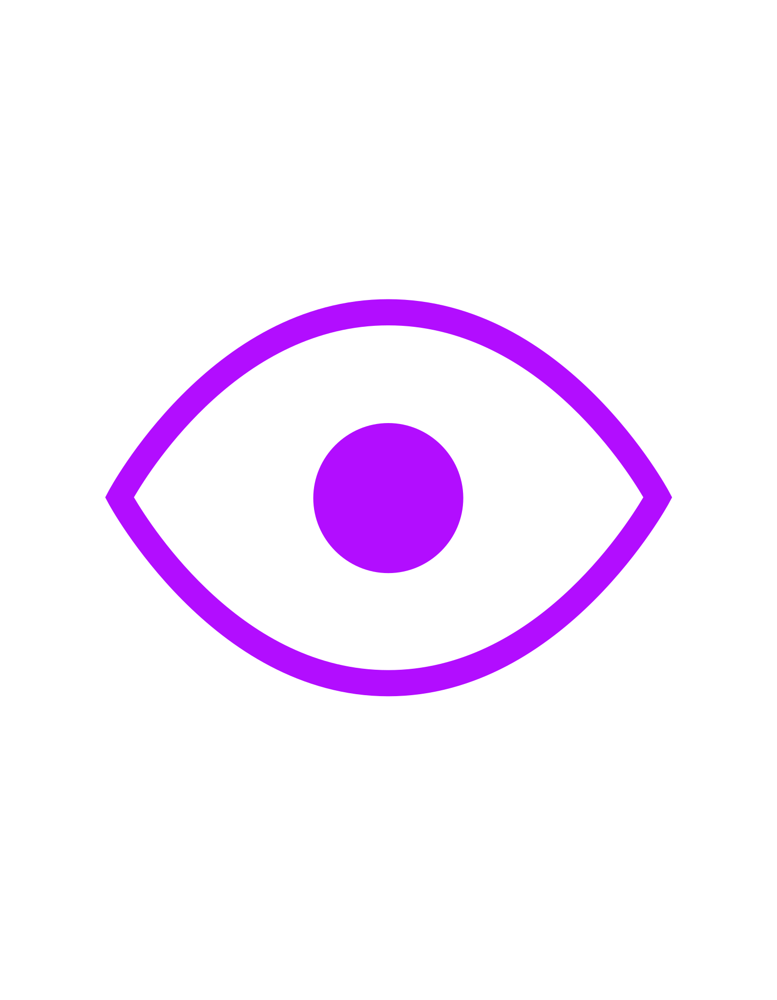
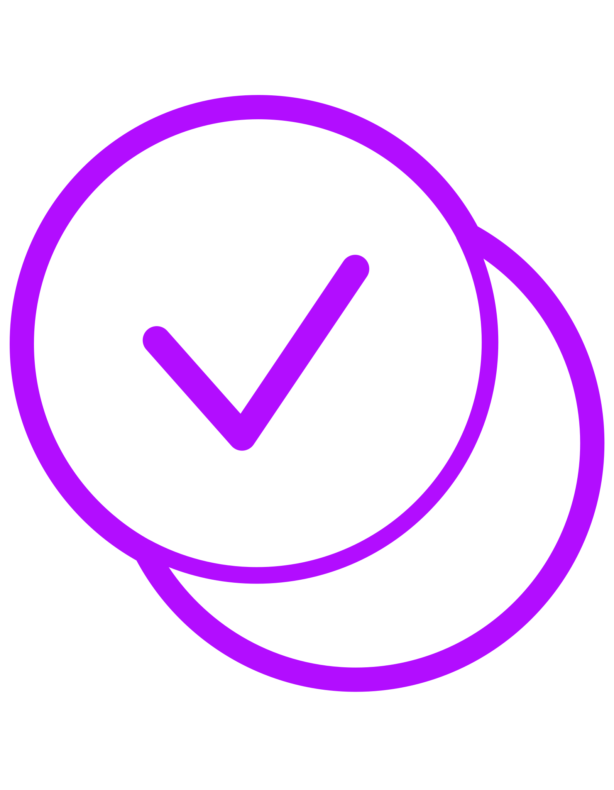
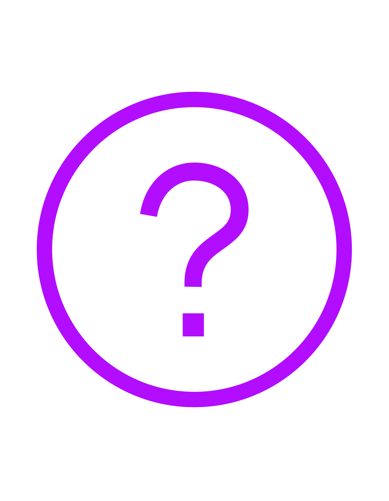
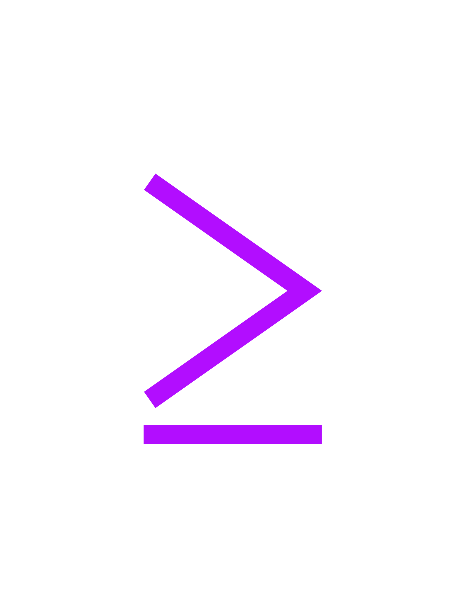
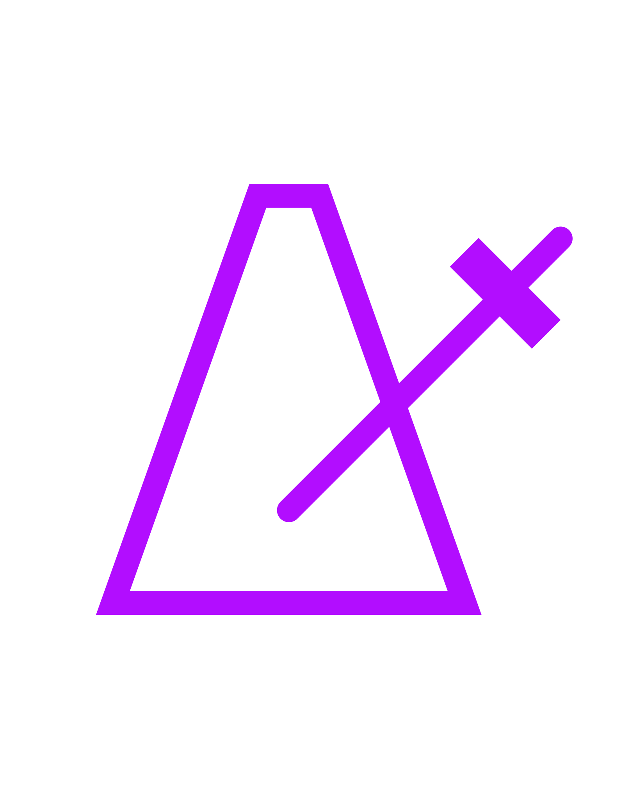
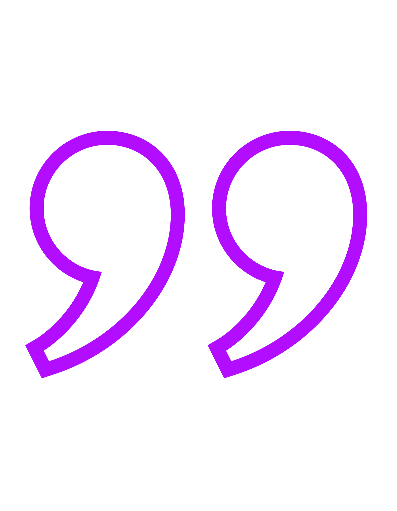
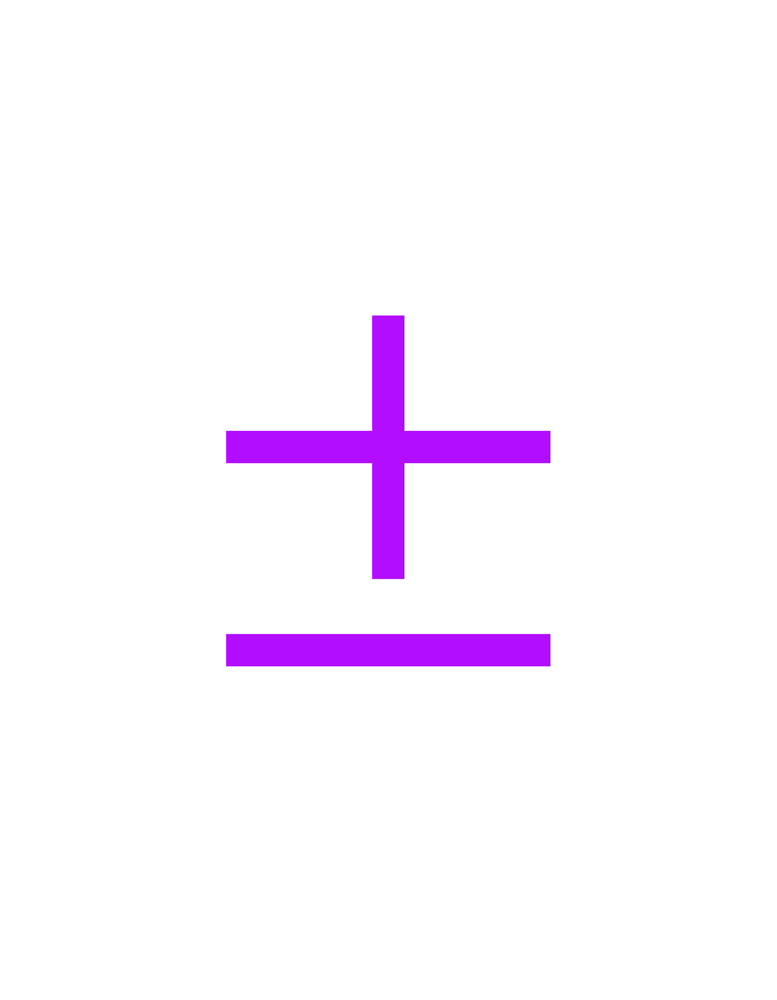

# ligature-cheatsheet

| glyph | name | triggers | previous glyphs |
|---|---|---|---|
|  | static | `static` |  |
|  | reference | `&` |  |
|   | mutable | `mut` |  |
|  | return | `return` |  |
|  | associated  function closure | `\|x\|x.` | |
|  | into | `into()` |  |
|  | public | `pub` |  |
|  | private | `priv` |  |
|  | const | `const` |  |
|  | multi line  comment start | `/*` |  |
|  | multi line  comment end | `*/` |  |
|  | match | `match` |       |
|  | continue | `continue` |  |
|  | break | `break` |  |
|  | iterate | `iter()` |  |
|  | filter | `filter(` |  |
|  | enumerate | `enumerate()` |  |
|  | contains | `enumerate()` |  |
|  | phantom data | `PhantomData` |  |
|  | result | `Result` |   |
|  | optional | `Option` |    |
|  | unwrap | `unwrap()` |  |
|  | clone | `clone()` |  |
|  | to owned | `to_owned()` |  |
|  | to string | `to_string()` |  |
|  | default | `Default::default()` |    |
|  | drop | `drop` |  |
|  | cell | `Cell<` |   |
|  | ref cell | `RefCell<` |   |
|  | replace | `replace(` |  |
|  | equal to | `.eq(` |  |
|  | not equal to | `.ne(` |  |
|  | less than | `.lt(` |  |
|  | greater than | `.gt(` |  |
|  | less  than equal | `.le(` |  |
|  | greater  than equal | `.ge(` |  |
|  | crate | `crate` |  |
|  | super | `super` |  |
|  | skip rust  format | `#[rustfmt::skip]` |  |
|  | format  string | `format!` |  |
|  | format args | `format_args!` |  |
|  | debug  print| `dbg!` |  |
|  | debug  format| `{:?}` |  |
|  | pretty  format| `{:#?}` |  |
|  | [ferris](https://rustacean.net) | `ferris` | |
|  | turbofish | `::<>` |  |
|  | cannot  infer type | `{unknown}` |  |
|  | unsafe | `unsafe` |  |
|  | assert | `assert!` |  |
|  | debug  assert | `debug_assert!` |  |
|  | debug  assertions | `debug_assertions` |  |
|  | async | `async` |  |
|  | await | `await` |  |
|  | syn quote | `quote!` |  |
|  | syn quote  spanned| `quote_spanned!` |  |
|  | stringify | `stringify` |  |
|  | boxed | `Box::new(`  `Rc::new(`  `Arc::new(` |  |
|  | macro rules | `macro_rules!` |  |
|  | plus minus | `plus_minus(` | |
|  | record | `.rec()` |     |
|  |  wgpu | `wgpu` | |
|  |  bytemuck | `bytemuck` |   |
|  |  first | `first()` | |
